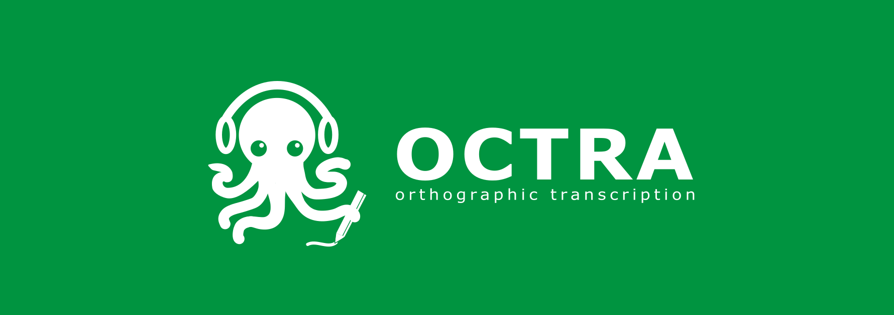

<h1 align="center">OCTRA v2.x (still in development)</h1>

  
  

    Octra is a web-application for the <b>o</b>rthographi<b>c</b> <b>tra</b>nscription of audiofiles. It allows you to transcribe your files from the computer or from a project created by the octra-backend software we are currently working at.
  

  

  
  
  
  
  
  
   
  <a href="https://clarin.phonetik.uni-muenchen.de/apps/octra/octra/features" style="font-weight:bold;">
 
    More information
  </a>

## Editors:

Octra supports different editors that you can choose according to your preferences. You can also switch between these easily while you are working on the same task.

* Dictaphone Editor: An typical, easy-to-use editor with just a texteditor and an audioplayer.
* Linear-Editor: This editor shows two signaldisplays: One for the whole view of the signal and one as loupe. You can set boundaries and define segments.
* 2D-Editor: This editor breaks the whole view of the signal to pieces and shows the pieces as lines one after one. Here you can set boundaries und define segments too.

## User Manual

You can find the manual for users here: [OCTRA Manual](https://clarin.phonetik.uni-muenchen.de/apps/octra/manuals/octra/)

## Features

* Three different editors
* Noise markers (placeholders) in the form of icons in text. Icons can be UTF-8 symbols, too.
* Auto-saving of the transcription progress to prevent data loss
* Import/Export support for various file formats like AnnotJSON, Textgrid, Text, Table and more.
* Validation using project specific guidelines. **New: text editor supports inline validation **
* Shortcuts for faster transcriptions
* Multi-Tiers support in local mode
* Logging of user activities for further studies
* Localization of the GUI
* Customization with configuration files for the app, project, guidelines and validation methods.
* Segment boundaries as markers in text
* Overview window to see the whole transcript
* Cutting audio files up to 300 MB
* Visible transcripts in 2D-Editor
* **New:** Costum table generator
* **New:** ASR support for transcription and segmentation

## Remarks

At the moment, OCTRA's online mode supports only one specific server database. That means, if you install OCTRA on your server, you can only use the local mode. We are working on supporting other servers (project "octra-backend" is in development).

## Libraries

The libraries are still in development. If you want to use them you find more information [here](libs/README.md).

## Production Use

### OCTRA website

If you don't want to install OCTRA, you can use the latest release [here](https://clarin.phonetik.uni-muenchen.de/apps/octra/octra/).

### Installation

In a production environment you don't need to compile OCTRA again.

1. Download the latest release from the releases page.``

2. Extract and Copy its content to your http-server. If you have already installed an older version of OCTRA, please notice to not override the old config folder. More information about upgrading can be found in the next section.

3. Before you can use OCTRA, duplicate and rename the `appconfig_sample.json` to `appconfig.json` in the config folder. Please make sure, that you offer all translation files for any language you defined in config.json.

4. To make OCTRA work please change the 'database:name' entry in your appconfig.json. After the first launch a new local database with this name will be created.

5. Please have a look on the projectconfig.json in the localmode folder. In this file you can change the settings of the local mode.

6. Change the baseref attribute in the index.html according to the url where your OCTRA installation is hosted.

7. Test if OCTRA works and check the webconsole if all works fine. If there are no errors you can use OCTRA.

### Upgrade

1. Duplicate and rename your octra directory (e.g. to 'octra_backup') on your server.

2. Download the new OCTRA release and upload the 'dist' folder to your server next to the backup and rename it to the same name like before (e.g. 'octra').

3. Copy your old appconfig.json and localmode folder to the new config directory.

4. Compare your appconfig.json with the new appconfig_samples.json file. If there are new entries, just copy and paste them to your appconfig.

5. Compare your projectconfig.json file with the new projectconfig.json file in the localmode folder.

6. Change the baseref attribute in the index.html according to the url where your OCTRA installation is hosted.

7. Test if OCTRA works and check the webconsole if all works fine. If there are no errors you can use OCTRA.

## Development Use

On the Development level OCTRA requires Node 6.9.0 or higher, together with NPM 3 or higher.

Then you can install OCTRA:

1. Clone the octra repository.
2. Go to the octra directory via Terminal (or GitBash on Windows).
3. Call `` npm install ``.
4. Wait.
5. Duplicate the file ``src/config/appconfig_sample.json`` and rename it to ``scr/config/appconfig.json``. In appconfig.json you can change the settings of your instance of OCTRA.
6. After the installation you can call `` npm start `` to start the node server.
7. After that please read the notice about the config files in the production use section

## Documentation

* For users: [OCTRA manual](https://clarin.phonetik.uni-muenchen.de/apps/octra/manual/1.3.0/)
* For project leaders/administrators: [Github Wiki](https://github.com/IPS-LMU/octra/wiki).

## Contribution

### Commit template

For this project <a href="https://github.com/commitizen/cz-cli">commitizen</a> is used. If you want to contribute to this project you should make use of this tool to create commit messages important for the changelog (other commit messages will be ignored otherwise). For WebStorm or PHPStorm there is a <a href="https://plugins.jetbrains.com/plugin/9861-git-commit-template">Commit Template Plugin</a> to create these templates.

For creating changelog automatically, <a href="https://github.com/conventional-changelog/conventional-changelog/tree/master/packages/conventional-changelog-cli">conventional-changelog-cli</a> is used. To create changelogs you need to install conventional-changelog-cli globally as described on its github page. After installation you just need to run `npm run changelog` to create the changelog automatically.

### Translation

To translate OCTRA to a new language please visit https://clarin.phonetik.uni-muenchen.de/apps/octra/translation/start.php

If the language you would like translate to does not exist please send us an email to octra@phonetik.uni-muenchen.de

### Affiliations

[INSTITUTE OF PHONETICS AND SPEECH PROCESSING](http://www.en.phonetik.uni-muenchen.de/)
