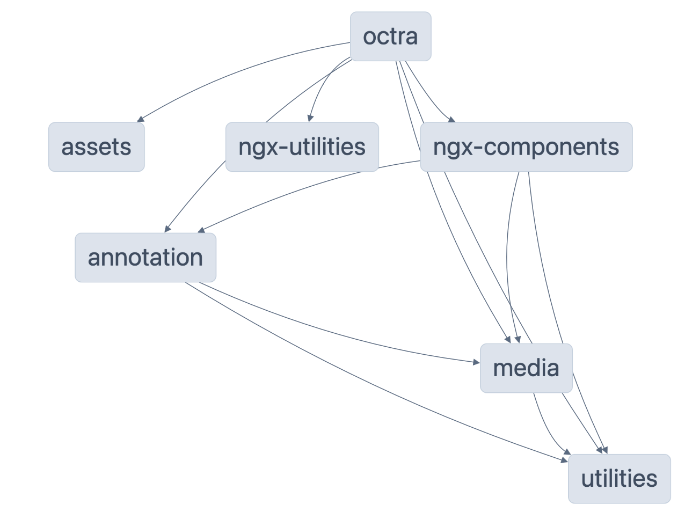

# OCTRA libraries

**OCTRA 2.0 and its libraries are still in development.**

This sections shows an overview of all custom libraries used by OCTRA. All Angular-specific libraries start with "ngx".

<table>
<thead>
<tr>
<th>Package</th>
<th>Compatibility</th>
<th>Description</th>
</tr>
</thead>
<tbody>
<tr>
<td>
<a href="./utilities/src/">utilities</a>
</td>
<td>
Browser, NodeJS
</td>
<td>
library with custom functions used in the  other libraries or apps like OCTRA
</td>
</tr>
<tr>
<td>
<a href="./media/src/">media</a>
</td>
<td>
Browser, NodeJS
</td>
<td>
all media related classes without dependencies to dom library
</td>
</tr>
<tr>
<td>
<a href="./web-media/src/">web-media</a>
</td>
<td>
Browser
</td>
<td>
all media related classes (for now audio only: audio playback a.s.o)
</td>
</tr>
<tr>
<td>
<a href="./assets/src/">assets</a>
</td>
<td>
Browser, NodeJS
</td>
<td>
library with shared assets in octra applications e.g. JSON schemata
</td>
</tr>
<tr>
<td>
<a href="./annotation/src/">annotation</a>
</td>
<td>
Browser, NodeJS
</td>
<td>
Objects and other classes used to handle annotation tasks
</td>
</tr>
<tr>
<td>
<a href="./ngx-components/src/">ngx-components</a>
</td>
<td>
Angular
</td>
<td>
Angular components e.g. for the signal displays
</td>
</tr>
<tr>
<td>
<a href="./ngx-utilities/src/">ngx-utilities</a>
</td>
<td>
Angular
</td>
<td>
library with custom functions used in angular projects
</td>
</tr>
<tr>
<td>
<a href="./web-components/src/">web-components</a>
</td>
<td>
Briwser
</td>
<td>
library with web-components containing components from ngx-components. These components can be used in other frameworks or Vanilla JS. <a href="../apps/web-components-demo/">See demo</a>.
</td>
</tr>
</tbody>
</table>

## API reference

You find more information about all classes and functions of each library [here](https://ips-lmu.github.io/octra).

## Dependency graph

Run `npm run dep-graph` to view the interactive dependency graph:

